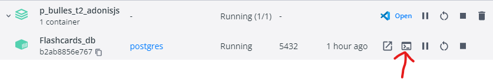

# Flashcards

Projet de Alban Segalen pour P_Bulles 2

## Installation

### Logiciels requis

- NodeJs: v20.11.0
- npm: v10.2.4
- Docker Desktop: v4.10.0

### Procédure d'installation

- Ouvrir un cmd à la racine du projet

  - Dans le dossier `flashcards` (`cd flashcards`)
  - Executer `npm install`
  - Puis `node ace generate:key`

- Dans le dossier `Docker_MySQL` (`cd ../Docker_MySQL`)

  - Executer `docker compose up -d`
  - Puis `docker exec -it Flashcards_db /bin/bash`
    - Si ça ne fonctionne pas :
      - Cliquez sur "OPEN IN TERMINAL"
        
  - Puis `mysql -u root -proot`
  - Puis `create database db_flashcards;`

- Dans le dossier `flashcards` (`cd ../flashcards`)

  - Ensuite `node ace migration:fresh`
  - Puis `npm run dev`

- Aller sur [localhost:3333](http://localhost:3333)
