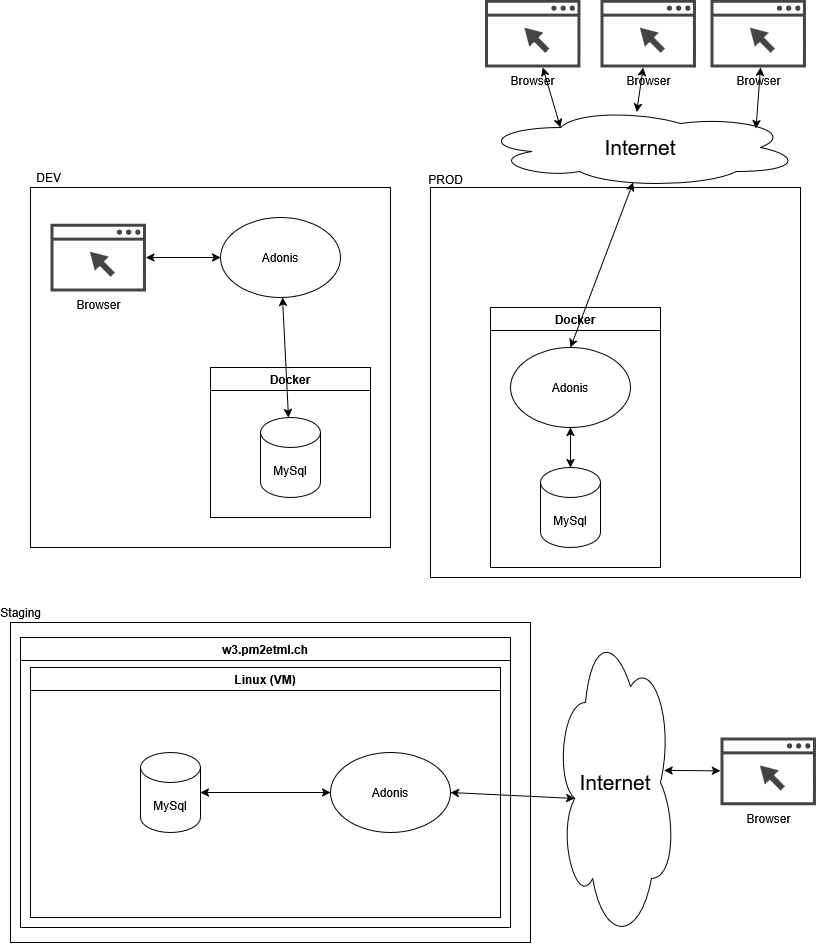
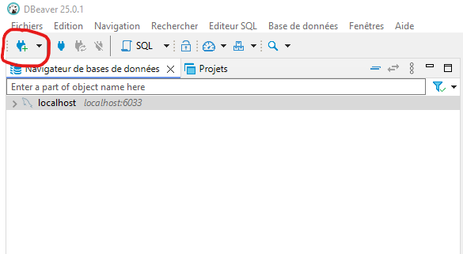
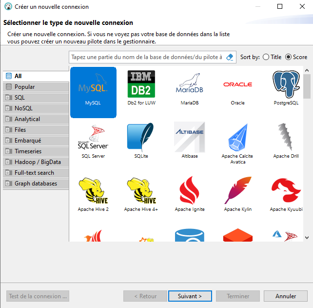
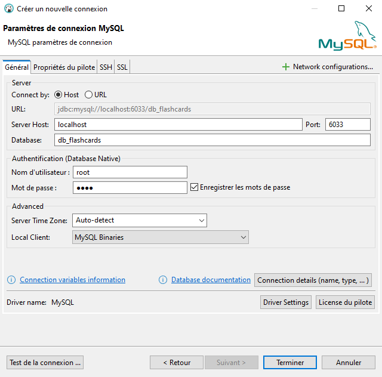
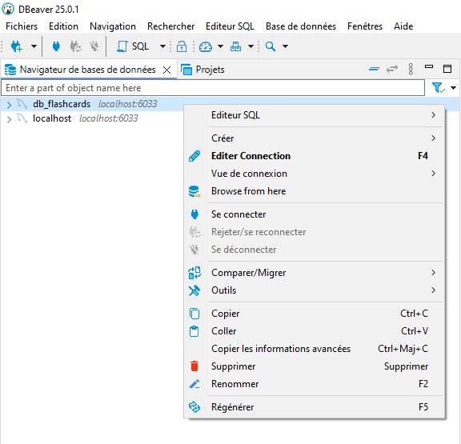
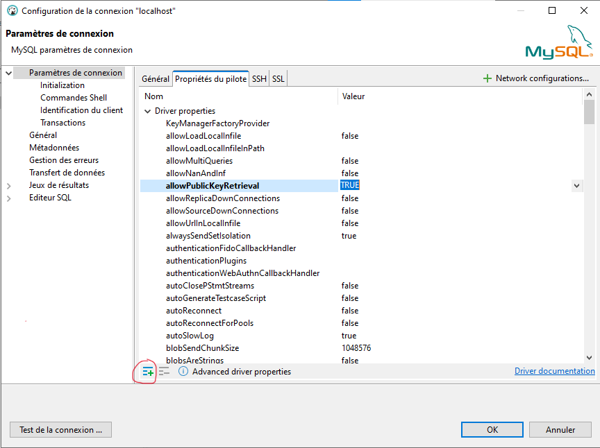

# Flashcards


Projet de Alban Segalen pour P_Bulles 2

# Table des matières

- [Installation](#installation)
  - [Logiciels requis](#logiciels-requis)
  - [Procédure d'installation](#proc%C3%A9dure-dinstallation)
- [DBeaver](#dbeaver)

# Environnements



## Développement

L'environnement utilisé pour le développement de l'application

### Installation

Voici comment mettre en place l'environnement de développement. Tous d'abord, voici la liste des logiciels requis.

| Logiciel                                                          | Version conseillée |
| ----------------------------------------------------------------- | ------------------ |
| [NodeJs](https://nodejs.org)                                      | v22.14.0           |
| [npm](https://www.npmjs.com/) (Inclus avec NodeJs)                | v10.9.2            |
| [Docker Desktop](https://www.docker.com/products/docker-desktop/) | v4.10.0            |

> Il s'agit des versions _minimum_, les versions plus récentes devraient aussi fonctionner.

#### Etape 1

Il faut d'abord cloner le repo [Flashcards](https://github.com/ASETML/Flashcards):

- en ligne de commande:

```sh
git clone https://github.com/ASETML/Flashcards
```

- avec [GitHub Desktop](https://github.com/apps/desktop)

#### Etape 2

Il maintenant démarrer la base de données. Pour cela, il faut ouvrir un invite de commande à la racine du repo.

- Aller dans le dossier qui contient le docker de la base de données :

```sh
cd Docker_Postgres
```

- Démarrer le conteneur :

```sh
docker-compose up -d
```

> Cette opération prend un peu de temps

- Accéder au conteneur:

```sh
docker exec -it Flashcards_db /bin/bash
```

> Ne fonctionne pas dans un git bash, à la place: <br>
> Cliquez sur "OPEN IN TERMINAL"
> 

- Puis, dans l'invite de commande du conteneur:

- Se connecter à l'utilisateur postgres :

```sh
su postgres
```

- Créer la base de données :

```sh
createdb db_flashcards
```

- Se déconnecter de l'utilisateur postgres :

```sh
exit
```

- Sortir du conteneur :

```sh
exit
```

La base de données est maintenant créée et démarrée

#### Etape 3

Il faut installer les dépendances.

- Naviguer dans le repertoire de l'application

```sh
cd ../flashcards
```

- Installer les dépendances avec npm

```sh
npm install
```

> Cette opération prend un peu de temps

### Etape 4

Il vous faut compléter les secrets de l'application.

Toujours dans le dossier `flashcards`

- Renommer le `.env.example` en `.env`

  - Depuis un cmd windows :

  ```cmd
  rename .env.example .env
  ```

  - Depuis un terminal

  ```sh
  mv .env.example .env
  ```

- Il faut ensuite générer APP_KEY:

```sh
node ace generate:key
```

> Vous aurez peut-être besoin d'adapter les informations du .env. Pour cela, il vous suffit d'éditer le fichier avec votre éditeur de texte préferé.

Les secrets de l'application sont maintenant renseigné.

#### Etape 5

Il faut exécuter les migrations pour créer les tables dans la base de données.

Toujours dans le dossier `flashcards`

- Exécuter les migrations

```sh
node ace migration:fresh
```

#### Etape 6

Il faut démarrer l'application:

```sh
npm run dev
```

L'application est maintenant démarrée. Bon développement !

## Staging

Il est prévu de mettre en place un environnement de test pour tester l'application avant de la mettre en production.

## Production

L'environnement de production est disponible à l'adresse https://flashcards-itg2.onrender.com/

Pour mettre en production l'application à votre tour, voici les étapes à suivres

### Installation

#### Prérequis

- Avoir un compte sur [Render](https://render.com)

# DBeaver

- Téléchargez DBeaver [https://dbeaver.io/download/](https://dbeaver.io/download/)
- J'utilise la version Community 25.0.1
- Pour se connecter à une base de donnée :
  - Cliquer sur l'icone d'ajout d'une connection 
  - Choisir le [SGBD](https://fr.wikipedia.org/wiki/Syst%C3%A8me_de_gestion_de_base_de_donn%C3%A9es), ici [MySql](https://www.mysql.com/), puis cliquez sur suivant 
  - Remplir les informations de connection en fonction du `./flashcards/.env`, puis cliquez sur terminer 
  - Pour se connecter, il faut faire un clic droit sur la connexion, puis cliquer sur se connecter 
- Si ça n'a pas fonctionné
  - Si l'erreur est : `Public Key Retrieval not Allowed`:
    - Clic Droit -> Editer connection
    - Dans l'onglet `Propriété du pilote`
      - Ajouter une propriété `allowPublicKeyRetrieval` avec une valeur de `TRUE` (cliquez sur l'icone +) [stackoverflow](https://stackoverflow.com/questions/61749304/connection-between-dbeaver-mysql) 
