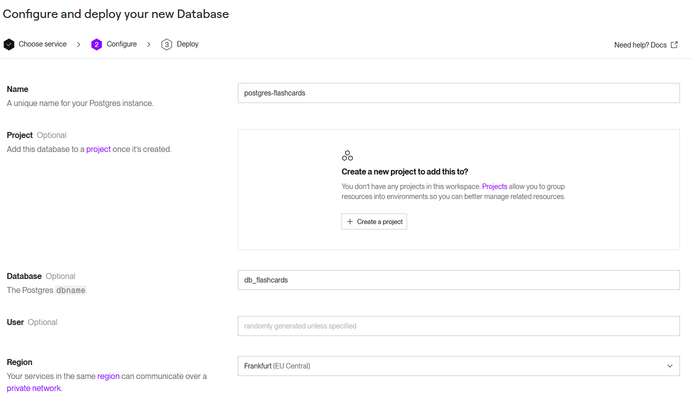
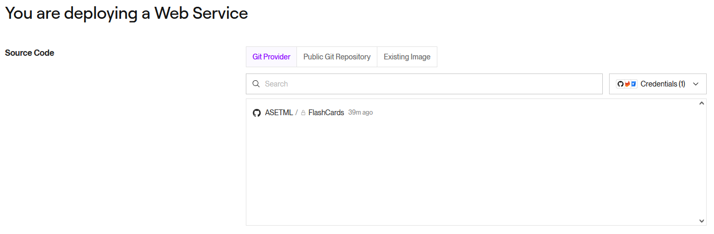
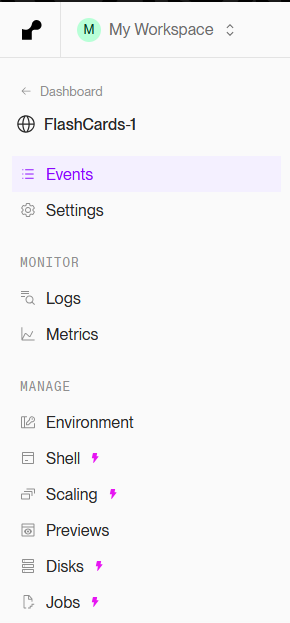
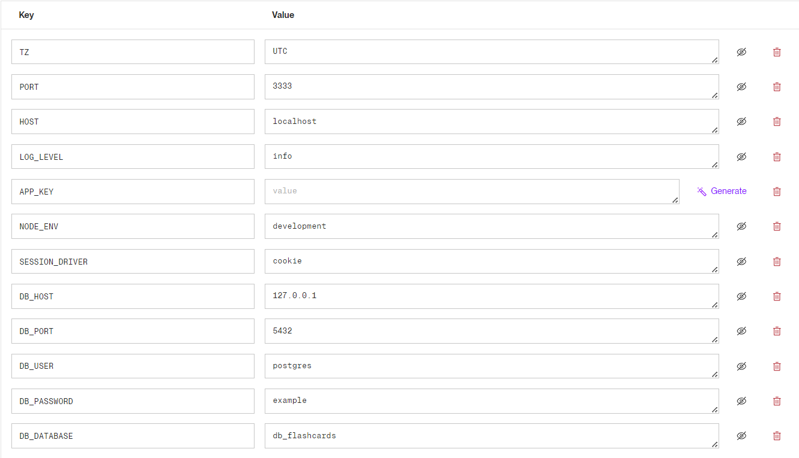
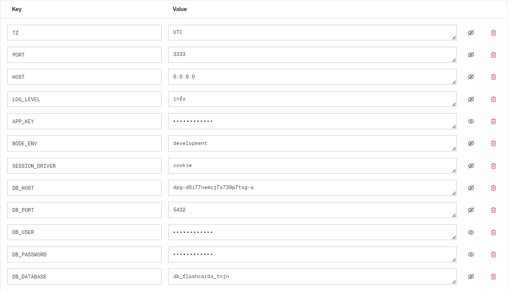

# Flashcards


Projet de Alban Segalen pour P_Bulles 3

# Table des matières

- [Environnements](#environnements)
  - [Développement](#d%C3%A9veloppement)
    - [Installation](#installation)
  - [Staging](#staging)
  - [Production](#production)
    - [Installation](#installation-1)
- [DBeaver](#dbeaver)

# Environnements
Voici un schéma des différents environnements.


## Développement

L'environnement utilisé pour le développement de l'application

### Installation

Voici comment mettre en place l'environnement de développement. Tous d'abord, voici la liste des logiciels requis.

| Logiciel                                                          | Version conseillée |
| ----------------------------------------------------------------- | ------------------ |
| [NodeJs](https://nodejs.org)                                      | v22.14.0           |
| [npm](https://www.npmjs.com/) (Inclus avec NodeJs)                | v10.9.2            |
| [Docker Desktop](https://www.docker.com/products/docker-desktop/) | v4.10.0            |

> Il s'agit des versions _minimum_, les versions plus récentes devraient aussi fonctionner.

#### Etape 1

Il faut d'abord cloner le repo [Flashcards](https://github.com/ASETML/Flashcards):

- en ligne de commande:

```sh
git clone https://github.com/ASETML/Flashcards
```

- avec [GitHub Desktop](https://github.com/apps/desktop)

#### Etape 2

Il maintenant démarrer la base de données. Pour cela, il faut ouvrir un invite de commande à la racine du repo.

- Aller dans le dossier qui contient le docker de la base de données :

```sh
cd Docker_Postgres
```

- Démarrer le conteneur :

```sh
docker-compose up -d
```

> Cette opération prend un peu de temps

- Accéder au conteneur:

```sh
docker exec -it Flashcards_db /bin/bash
```

> Ne fonctionne pas dans un git bash, à la place: <br>
> Cliquez sur "OPEN IN TERMINAL"
> 

- Puis, dans l'invite de commande du conteneur:

- Se connecter à l'utilisateur postgres :

```sh
su postgres
```

- Créer la base de données :

```sh
createdb db_flashcards
```

- Se déconnecter de l'utilisateur postgres :

```sh
exit
```

- Sortir du conteneur :

```sh
exit
```

La base de données est maintenant créée et démarrée

#### Etape 3

Il faut installer les dépendances.

- Naviguer dans le repertoire de l'application

```sh
cd ../flashcards
```

- Installer les dépendances avec npm

```sh
npm install
```

> Cette opération prend un peu de temps

### Etape 4

Il vous faut compléter les secrets de l'application.

Toujours dans le dossier `flashcards`

- Renommer le `.env.example` en `.env`

  - Depuis un cmd windows :

  ```cmd
  rename .env.example .env
  ```

  - Depuis un terminal

  ```sh
  mv .env.example .env
  ```

- Il faut ensuite générer APP_KEY:

```sh
node ace generate:key
```

> Vous aurez peut-être besoin d'adapter les informations du .env. Pour cela, il vous suffit d'éditer le fichier avec votre éditeur de texte préferé.

Les secrets de l'application sont maintenant renseigné.

#### Etape 5

Il faut exécuter les migrations pour créer les tables dans la base de données.

Toujours dans le dossier `flashcards`

- Exécuter les migrations

```sh
node ace migration:fresh
```
Vous pouvez vérifier que les tables ont bien été crées avec [DBeaver](#dbeaver).

#### Etape 6

Il faut démarrer l'application:

```sh
npm run dev
```

L'application est maintenant démarrée. Bon développement !

## Staging

Il est prévu de mettre en place un environnement de test pour tester l'application avant de la mettre en production.

## Production

L'environnement de production est disponible à l'adresse https://flashcards-itg2.onrender.com/.

L'application est déployée sur [Render](https://render.com)

### Installation

Pour mettre en production l'application à votre tour, voici les étapes à suivres

#### Création du compte

Si vous n'avez pas de compte sur [Render](https://render.com), en créer un. Choisir le plan gratuit.


#### Création de la db
Depuis la page d'accueil, créez un nouveau service de type postgres.


Configurez ensuite le service. Choisir le plan gratuit.



> Attention à la région -> Les services ne peuvent communiquer entre eux que si ils ont la même région

Cliquez sur `Create Database`


La base de données est maintenant créée.

#### Création de l'app
Depuis la page d'accueil, ajouter un nouveau service de type `Web Service`.


Connectez ensuite votre compte [github](https://github.com), vous en aurez besoin pour déployer l'application automatiquement à chaque commit. Vous pouvez ajouter Render à un seul repository ou à tous vos repository. 


Selectionner le repo [Flashcards](https://github.com/ASETML/FlashCards)


Configurez votre service. Choissisez `Docker comme langage`. Spécifier bien l'emplacement de la l'application dans le repo dans le champs `Root Directory`. Choissisez le plan gratuit.


> Choissisez bien la même région que la base de données

#### Variables d'environnement
L'application a besoin de variables d'environnement pour fonctionner: voici comment les spécifier.

Sur la page du `Web Service`, allez dans l'onglet `Environment`.



Cliquez sur `Add` -> `From .env`.


 Chargez le  [`.env.example`](./flashcards/.env.example)


Cliquez sur `Add variables`.


Vous devriez avoir le résultats suivant



Complétez les informations manquantes: `HOST` doit être `0.0.0.0`. Pour Générer `APP_KEY`, cliquez sur `Generate`. Completez les variables `DB_*` selon les informations du service Postgres.

| Web Service | Postgres |
| -------- | --- |
| DB_DATABASE | Database |
| DB_HOST | Hostname |
| DB_PASSWORD | Password |
| DB_PORT | Username |
| DB_USER | Username |



Cliquez sur `Save, Build and Deploy` pour déployer votre application. Vous pouvez y accéder en utilisant l'url en dessous du nom de votre service.


Si en allant sur votre application vous avez une erreur `Blocked request. This host ("flashcards-1-8dam.onrender.com") is not allowed.`, vous devez ajouter le nom de domaine dans le fichier `vite.config.ts`. Par example:


Si l'élèment `allowedHosts` n'est pas présent, ajouter le comme suit.
```ts
server: {
    allowedHosts: ['flashcards-itg2.onrender.com'],
  },
```

```ts
import { defineConfig } from 'vite'
import adonisjs from '@adonisjs/vite/client'

export default defineConfig({
  server: {
    allowedHosts: ['flashcards-itg2.onrender.com'],
  },
  plugins: [
    adonisjs({
      /**
       * Entrypoints of your application. Each entrypoint will
       * result in a separate bundle.
       */
      entrypoints: ['resources/css/app.css', 'resources/js/app.js'],

      /**
       * Paths to watch and reload the browser on file change
       */
      reload: ['resources/views/**/*.edge'],
    }),
  ],
})
```

# DBeaver

- Téléchargez DBeaver [https://dbeaver.io/download/](https://dbeaver.io/download/)
- J'utilise la version Community 25.0.1
- Pour se connecter à une base de donnée :
  - Cliquer sur l'icone d'ajout d'une connection 
  - Choisir le [SGBD](https://fr.wikipedia.org/wiki/Syst%C3%A8me_de_gestion_de_base_de_donn%C3%A9es), ici [MySql](https://www.mysql.com/), puis cliquez sur suivant 
  - Remplir les informations de connection en fonction du `./flashcards/.env`, puis cliquez sur terminer 
  - Pour se connecter, il faut faire un clic droit sur la connexion, puis cliquer sur se connecter 
- Si ça n'a pas fonctionné
  - Si l'erreur est : `Public Key Retrieval not Allowed`:
    - Clic Droit -> Editer connection
    - Dans l'onglet `Propriété du pilote`
      - Ajouter une propriété `allowPublicKeyRetrieval` avec une valeur de `TRUE` (cliquez sur l'icone +) [stackoverflow](https://stackoverflow.com/questions/61749304/connection-between-dbeaver-mysql) 
